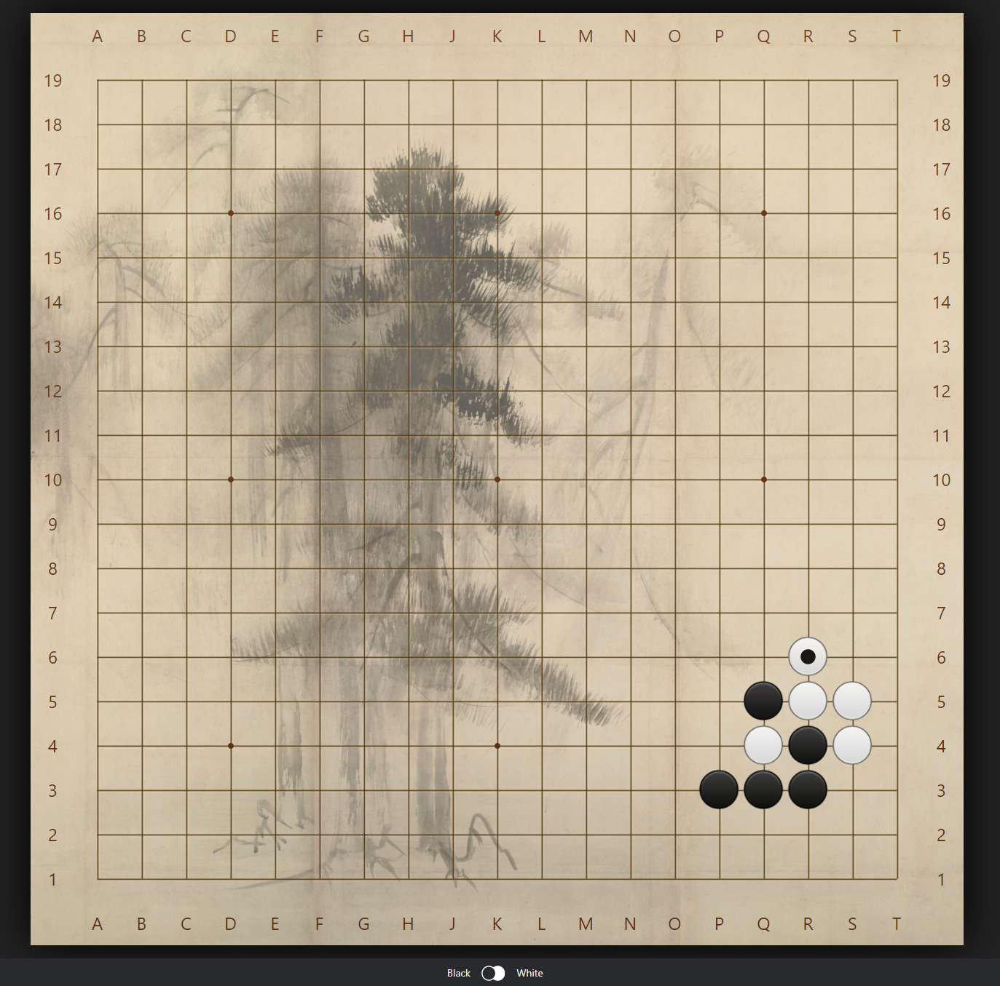

# Sabaki Subtle Theme

* Theme for [Sabaki SGF editor](https://github.com/yishn/Sabaki) **0.40.0** or later.
* To install, just download the asar file and then, in Sabaki, see Preferences --> Themes.

* This theme is a mix of [Jdriselvato's Hikaru-2 theme](https://github.com/jdriselvato/Hikaru-2-Sabaki-Theme/), and [Rooklift's Subdued theme](https://github.com/rooklift/sabaki_subdued_theme_40), with some custom edits.

* Image Credit: [Shōrin-zu byōbu](https://en.wikipedia.org/wiki/Sh%C5%8Drin-zu_by%C5%8Dbu). (Public Domain).  Edited by Bugcat