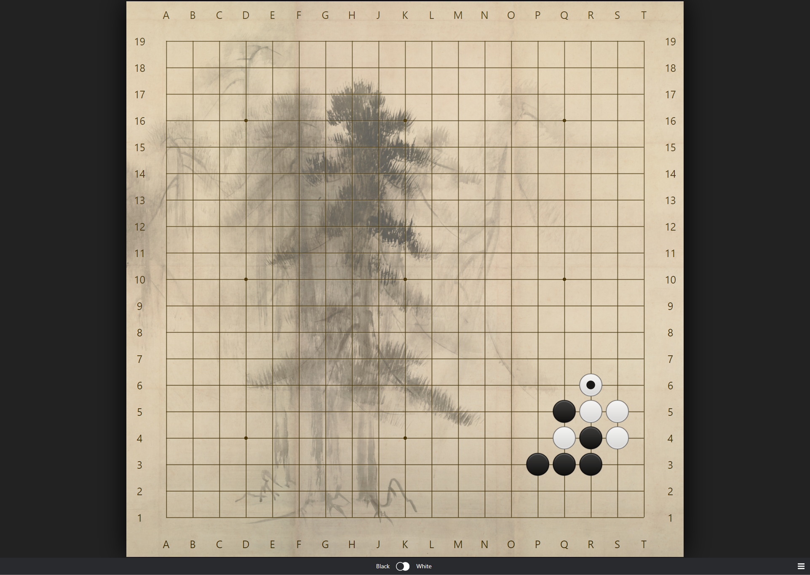
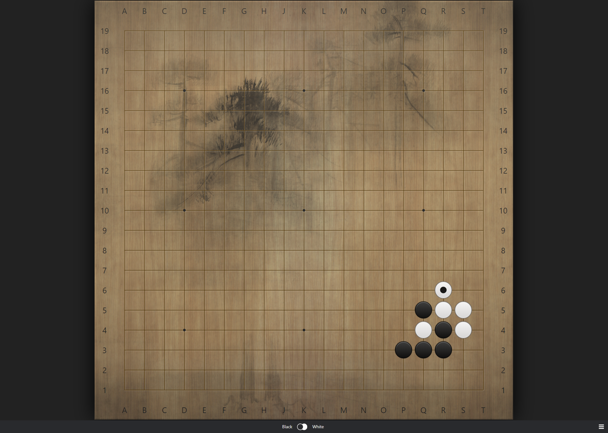

# Sabaki Subtle Theme
Shōrin-zu byōbu (Japanese Pine Trees) faded onto goban with natural styles.

* A theme for [Sabaki SGF editor](https://github.com/yishn/Sabaki) **0.40.0** or later.

| Theme                                                                                              | Screenshot                                                                                                          |
| -------------------------------------------------------------------------------------------------- | ------------------------------------------------------------------------------------------------------------------- |
| Subtle - Paper                                                                                     |                                                               |
| Subtle - Kaya                                                                                      |                                                               |
| Subtle - Dark                                                                                      |                                                                |

### Installation
* First download the asar file
  * [Subtle - Paper](https://github.com/RobertChrist/Sabaki-Subtle-Theme/raw/main/dist/subtle_paper.asar)
  * [Subtle - Kaya](https://github.com/RobertChrist/Sabaki-Subtle-Theme/raw/main/dist/subtle_kaya.asar)
  * [Subtle - Dark](https://github.com/RobertChrist/Sabaki-Subtle-Theme/raw/main/dist/subtle_dark.asar)
* And then in Sabaki, install the file via Preferences --> Themes.

### Credits
* This theme is an iteration of [Jdriselvato's Hikaru-2 theme](https://github.com/jdriselvato/Hikaru-2-Sabaki-Theme/), and [Rooklift's Subdued theme](https://github.com/rooklift/sabaki_subdued_theme_40).
* Image Credit: [Shōrin-zu byōbu](https://en.wikipedia.org/wiki/Sh%C5%8Drin-zu_by%C5%8Dbu). (Public Domain).  Edited by Bugcat, and g-g-g-g-g-g-Go.